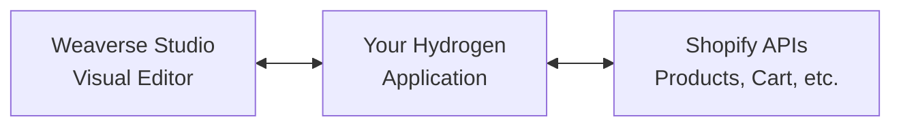

# Understanding Weaverse Architecture

Weaverse seamlessly integrates with Shopify Hydrogen to provide a visual page building experience without compromising developer control or performance.

## Architecture Overview



**Three-Layer Architecture:**

- **Weaverse Studio**: Visual page builder interface where merchants create and edit content
- **Your Hydrogen Application**: React Router v7 app with your custom components and business logic  
- **Shopify APIs**: Product data, cart functionality, and e-commerce operations

## The Weaverse Workflow

### 1. Developer Experience

**Code Components Once**
```tsx
// You write React components with schemas
import { createSchema } from '@weaverse/hydrogen'
import type { HydrogenComponentProps } from '@weaverse/hydrogen'

interface ProductCardProps extends HydrogenComponentProps {
  title?: string
  price?: string
}

function ProductCard({ title, price, ...rest }: ProductCardProps) {
  return <div {...rest}>{title} - {price}</div>
}

export default ProductCard

export const schema = createSchema({
  type: 'product-card',
  title: 'Product Card',
  settings: [/* configuration */]
})
```

**Register Components**  
```tsx
// Components are registered in app/weaverse/components.ts
import * as ProductCard from '~/sections/product-card'

export const components: HydrogenComponent[] = [
  ProductCard,
  // other components...
]
```

### 2. Merchant Experience

**Visual Editing**
- Merchants drag components onto pages
- Real-time preview across all devices  
- Intuitive settings panels for customization
- No code required

**Content Management**
- Create and manage pages visually
- Organize content with sections and components
- Preview changes before publishing

### 3. Runtime Performance

**Zero Runtime Overhead**
- Components are pre-rendered at build time
- No client-side JavaScript for page building
- Only your component logic ships to browsers

**Optimized Builds**
- Automatic image optimization
- Code splitting by page
- Server-side rendering with Hydrogen

## Key Concepts

### Components vs Sections

**Components** are reusable UI elements:
- Buttons, cards, forms
- Configured through props
- Can be used multiple times per page

**Sections** are page-level building blocks:
- Headers, hero areas, footers  
- Container multiple components
- Define page structure

### Schema-Driven Configuration

Every Weaverse component includes a schema that defines:

```tsx
export const schema = createSchema({
  type: 'unique-component-name',
  title: 'Human-readable Title',
  settings: [
    {
      group: 'Content',
      inputs: [
        {
          type: 'text',
          name: 'heading',
          label: 'Heading Text',
          defaultValue: 'Hello World'
        }
      ]
    }
  ]
})
```

This schema automatically generates:
- Visual editor controls
- TypeScript types
- Validation rules
- Default values

### Data Flow

1. **Build Time**: Schemas define available components
2. **Edit Time**: Merchants configure component instances  
3. **Runtime**: Pre-rendered HTML serves to visitors
4. **Hydration**: Interactive components become functional

## Integration with Hydrogen

Weaverse leverages Hydrogen's architecture:

- **React Router v7**: File-based routing with type safety
- **Server Components**: Fast initial page loads
- **Shopify APIs**: Native product and cart integration
- **Performance**: Optimized for Core Web Vitals

## Development Modes

### Local Development
- Hot reload for instant feedback
- Weaverse Studio runs alongside your app
- Real-time component updates

### Production
- Components are pre-built and optimized
- Merchants edit through hosted Weaverse Studio
- Changes deploy through your CI/CD pipeline

## Benefits

**For Developers:**
- Full control over component logic
- Modern React development experience
- No vendor lock-in
- Standard deployment workflows

**For Merchants:**  
- Visual page building
- No technical knowledge required
- Real-time preview
- Mobile-responsive editing

**For Customers:**
- Fast loading pages
- Mobile-optimized experiences
- Consistent brand presentation
- Accessible by default

## Next Steps

- Learn about [Project Structure](core-concepts/project-structure)
- Start building with the [Development Guide](development-guide)
- Explore the [API Reference](api-reference) for advanced usage