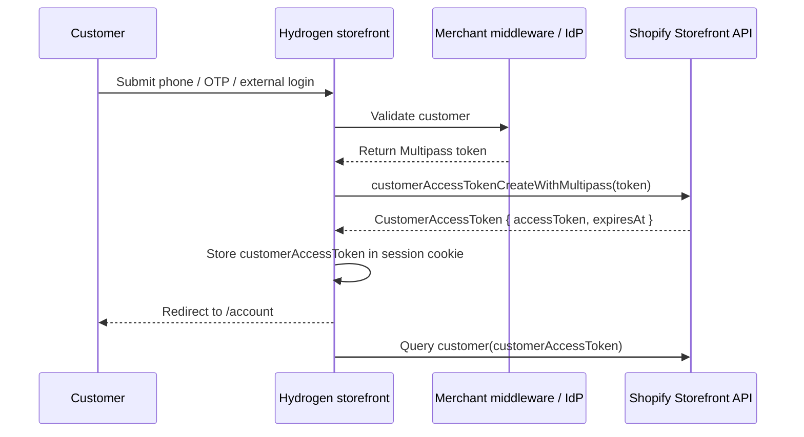

# Multipass in Hydrogen

Multipass lets a Shopify Plus merchant authenticate customers in an external system, then sign them into Shopify without asking for a Shopify password again. In Hydrogen, the recommended implementation is to exchange the Multipass token for a Storefront API `CustomerAccessToken`, store that access token in the Hydrogen session cookie, then use it for customer profile, order, address, and cart buyer identity calls.

<Warning>
  Multipass is a **legacy customer accounts** feature. It does **not** work with Shopify's Customer Account API OAuth flow (`/account/login` → `/account/authorize`). If your storefront uses the Customer Account API routes from the Pilot theme, you must either keep that flow, or replace the account area with a legacy Storefront API customer-token flow.
</Warning>

## When to use Multipass

Use this guide when the merchant already has an external identity system, for example:

- A mobile app or loyalty app authenticates customers first
- An enterprise CRM validates customers by phone/OTP
- Middleware checks or creates the Shopify customer
- The middleware returns a Shopify Multipass token
- Hydrogen needs to complete login without sending the customer through Shopify's hosted login screen

Do **not** use Multipass for new builds unless the merchant has a hard legacy SSO requirement. Shopify's recommended path for new customer account implementations is the Customer Account API.

## Requirements

- Shopify Plus store
- **Legacy customer accounts** selected in **Shopify Admin → Settings → Customer accounts**
- Multipass enabled in Shopify admin
- Storefront API token with customer access-token permissions
- A server-side middleware or backend that generates Multipass tokens
- A Hydrogen storefront with cookie session support

<Warning>
  Never generate a Multipass token in the browser. The Multipass secret must stay server-side.
</Warning>

## Architecture



The Multipass token is only an exchange credential. Hydrogen should store the returned `customerAccessToken`, not the Multipass token.

## Multipass token rules

Shopify's Storefront API mutation has two important constraints:

- Multipass tokens are valid for **15 minutes**
- Multipass tokens are **single-use**

Generate a fresh token on demand when a customer logs in. Do not pre-generate tokens, reuse tokens, or log them.

## Step 1 — Exchange Multipass for a customer access token

Create a server-side route that receives the Multipass token and exchanges it with Shopify.

Example route: `app/routes/account/multipass.tsx`

```ts
import {redirect, type ActionFunctionArgs} from 'react-router';

const CUSTOMER_ACCESS_TOKEN_CREATE_WITH_MULTIPASS = `#graphql
  mutation customerAccessTokenCreateWithMultipass($multipassToken: String!) {
    customerAccessTokenCreateWithMultipass(multipassToken: $multipassToken) {
      customerAccessToken {
        accessToken
        expiresAt
      }
      customerUserErrors {
        code
        field
        message
      }
    }
  }
`;

export async function action({request, context}: ActionFunctionArgs) {
  const formData = await request.formData();
  const multipassToken = String(formData.get('multipassToken') || '');

  if (!multipassToken) {
    throw new Response('Missing Multipass token', {status: 400});
  }

  const {customerAccessTokenCreateWithMultipass} =
    await context.storefront.mutate(
      CUSTOMER_ACCESS_TOKEN_CREATE_WITH_MULTIPASS,
      {
        variables: {multipassToken},
        cache: context.storefront.CacheNone(),
      },
    );

  const errors =
    customerAccessTokenCreateWithMultipass?.customerUserErrors || [];

  if (errors.length) {
    throw new Response(errors[0].message, {status: 400});
  }

  const customerAccessToken =
    customerAccessTokenCreateWithMultipass?.customerAccessToken;

  if (!customerAccessToken?.accessToken) {
    throw new Response('Unable to create customer access token', {
      status: 400,
    });
  }

  context.session.set('customerAccessToken', {
    accessToken: customerAccessToken.accessToken,
    expiresAt: customerAccessToken.expiresAt,
  });

  return redirect('/account', {
    headers: {
      'Set-Cookie': await context.session.commit(),
    },
  });
}
```

<Note>
  You can use a `loader` instead of an `action` if your external system redirects to Hydrogen with a token in the URL. Prefer `POST` when possible so tokens are not stored in browser history, server logs, analytics tools, or referer headers.
</Note>

## Step 2 — Read the token from the Hydrogen session

In legacy customer account routes, read the stored token from `context.session`.

```ts
import {redirect, type LoaderFunctionArgs} from 'react-router';

const CUSTOMER_QUERY = `#graphql
  query Customer($customerAccessToken: String!) {
    customer(customerAccessToken: $customerAccessToken) {
      id
      email
      firstName
      lastName
      phone
      orders(first: 10, sortKey: PROCESSED_AT, reverse: true) {
        nodes {
          id
          name
          processedAt
          totalPrice {
            amount
            currencyCode
          }
        }
      }
    }
  }
`;

export async function loader({context}: LoaderFunctionArgs) {
  const token = context.session.get('customerAccessToken');

  if (!token?.accessToken) {
    return redirect('/account/login');
  }

  const {customer} = await context.storefront.query(CUSTOMER_QUERY, {
    variables: {
      customerAccessToken: token.accessToken,
    },
    cache: context.storefront.CacheNone(),
  });

  if (!customer) {
    context.session.unset('customerAccessToken');
    return redirect('/account/login', {
      headers: {
        'Set-Cookie': await context.session.commit(),
      },
    });
  }

  return {customer};
}
```

## Step 3 — Associate the customer with the cart

After login, update the cart buyer identity with the Storefront API customer token.

```ts
const token = context.session.get('customerAccessToken');

if (token?.accessToken) {
  await context.cart.updateBuyerIdentity({
    customerAccessToken: token.accessToken,
  });
}
```

This helps Shopify associate the cart and checkout with the authenticated customer.

## Step 4 — Logout

Unset the customer access token from the Hydrogen session. If your merchant identity provider also has a session, redirect to its logout endpoint too.

```ts
import {redirect, type ActionFunctionArgs} from 'react-router';

export async function action({context}: ActionFunctionArgs) {
  context.session.unset('customerAccessToken');

  return redirect('/', {
    headers: {
      'Set-Cookie': await context.session.commit(),
    },
  });
}
```

## Adapting the Pilot theme

The Pilot theme ships with Customer Account API routes by default:

- `/account/login` starts Shopify's Customer Account API OAuth flow
- `/account/authorize` completes the OAuth callback
- Account pages query `context.customerAccount`

For Multipass, this is a different auth model. You need to replace or fork the account routes so they use:

- `context.storefront.mutate(customerAccessTokenCreateWithMultipass)` for login
- `context.session.get('customerAccessToken')` for session state
- Storefront API `customer(customerAccessToken: ...)` queries for profile, orders, and addresses
- `context.cart.updateBuyerIdentity({customerAccessToken})` for cart association

<Warning>
  Do not try to pass a Multipass token to `/account/authorize`. That route is only the OAuth callback for Shopify's Customer Account API and is not a token-ingestion endpoint.
</Warning>

## Domain setup

Multipass does not have a callback-domain setup like Customer Account API OAuth. The domain depends on the implementation:

### Standard Shopify Multipass redirect

Redirect to the Shopify Online Store / classic account domain:

```txt
https://{shop-domain}/account/login/multipass/{multipass_token}
```

Use this when the Liquid/Online Store customer-account session is the destination.

### Hydrogen-native Multipass exchange

Redirect or post to your Hydrogen route:

```txt
https://www.example.com/account/multipass
```

Hydrogen exchanges the token with `customerAccessTokenCreateWithMultipass` and sets its own session cookie.

<Note>
  If Liquid and Hydrogen run in parallel, use separate domain targets in Shopify: for example `www.example.com` for Hydrogen and `checkout.example.com` or `liquid.example.com` for Online Store. Checkout remains Shopify checkout either way.
</Note>

## Security checklist

- Keep the Multipass secret only in the merchant backend
- Generate Multipass tokens on demand
- Send tokens to Hydrogen server-side or via short-lived POST only
- Never store the Multipass token in the session
- Store only the returned `customerAccessToken`
- Use `httpOnly`, `sameSite: 'lax'`, and secure session cookies in production
- Use `CacheNone()` for authenticated customer/account queries
- Clear the session when the token is expired or customer lookup fails
- Avoid logging tokens, request bodies, query strings, or GraphQL variables that contain credentials

## Troubleshooting

<AccordionGroup>
  <Accordion title="`customerAccessTokenCreateWithMultipass` returns an error">
    Confirm that Multipass is enabled, the store is on Shopify Plus, the store uses legacy customer accounts, and the token was generated with the correct Multipass secret. Also confirm that the token has not expired or already been used.
  </Accordion>
  <Accordion title="Customer logs in but account page still redirects to Shopify login">
    The route is probably still using `context.customerAccount.handleAuthStatus()` or `context.customerAccount.query()`. Multipass requires legacy Storefront API customer-token queries instead.
  </Accordion>
  <Accordion title="Orders or profile data are empty">
    Check that you are querying Storefront API customer fields with `customer(customerAccessToken: ...)`, not Customer Account API fields. Also verify the Multipass token uses the same email address as the Shopify customer record.
  </Accordion>
  <Accordion title="Checkout is not associated with the logged-in customer">
    Call `context.cart.updateBuyerIdentity({customerAccessToken})` after login or before checkout. Use the returned Storefront API customer access token, not the Multipass token.
  </Accordion>
  <Accordion title="Customer Account API and Multipass both need to work">
    Treat this as a custom dual-auth project. The two systems use different session models and account APIs. In most cases, the cleaner approach is to move existing customers into one IdP path using the same email address, or use a pure legacy customer-token flow if Multipass is mandatory.
  </Accordion>
</AccordionGroup>

## References

- [Shopify Multipass](https://shopify.dev/docs/api/customer-authentication/multipass)
- [Storefront API: customerAccessTokenCreateWithMultipass](https://shopify.dev/docs/api/storefront/latest/mutations/customerAccessTokenCreateWithMultipass)
- [Manage customer accounts with the Storefront API](https://shopify.dev/docs/storefronts/headless/building-with-the-storefront-api/customer-accounts)
- [Customer Account API with Hydrogen](https://shopify.dev/docs/storefronts/headless/building-with-the-customer-account-api/hydrogen)
