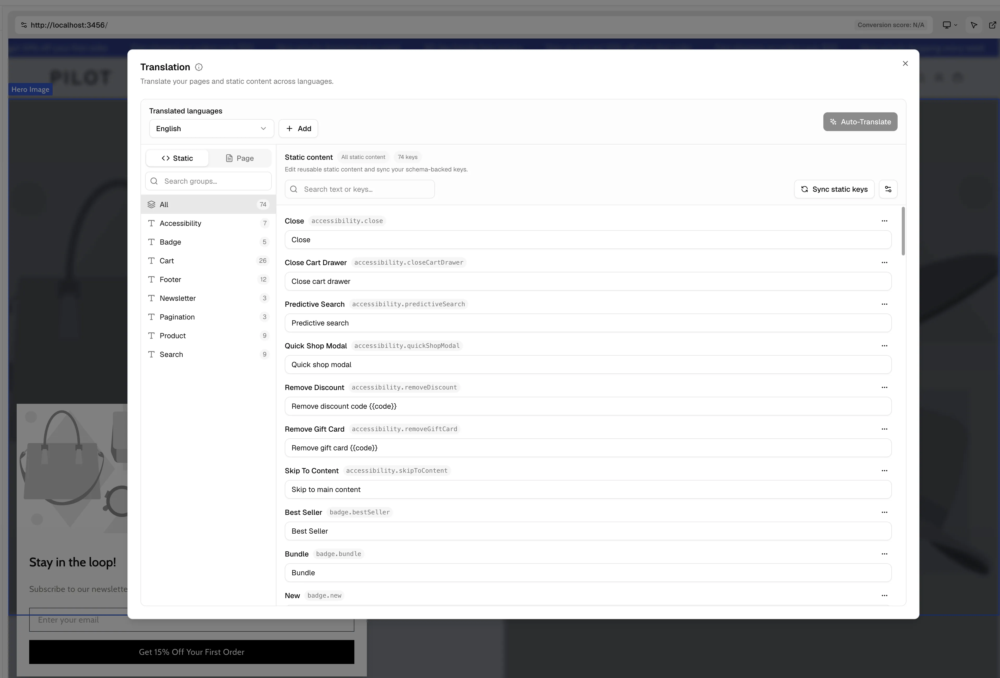
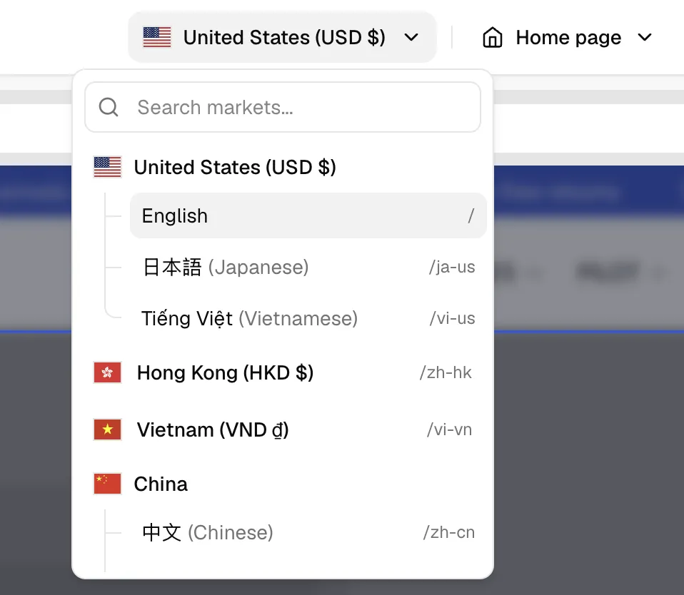
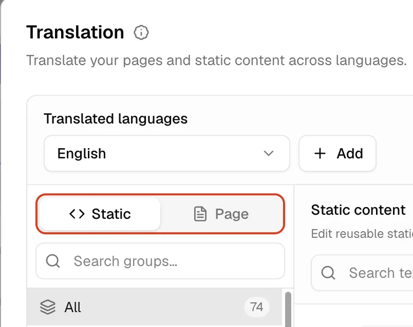

# Translation Feature Guide

This guide shows how to set up and use the `Translation Manager` in Weaverse Studio to localize your storefront — reusable theme strings and page content — with AI auto-translation and a built-in review step.

## Overview

`Translation Manager` localizes two kinds of content inside a Weaverse project:

1. `Theme content`: reusable storefront strings like button labels, empty states, and helper text (from your theme schema's `i18n.staticContent`).
2. `Page content`: text and image content extracted from your page sections, blocks, and elements.

You author content **once** in your default language, then let the manager fan it out to every other language with one click — review, refine, and you're done.

> [!NOTE]
> This is a different layer from the Hydrogen i18n loader (`schema.server.ts` / `loadPage()`), which controls how a published storefront *reads* translations at runtime. Use the i18n loader to wire locales into your theme (see [Markets and Localization](./markets-localization)); use the `Translation Manager` to actually *produce* the translations.


{/* TODO (screenshot): Translation Manager dialog open, full window, a target language selected, side-by-side editor visible */}

## Core concept: Market vs. Language

Weaverse separates **what region a page targets** from **what language it is read in**. Understanding this split is the key to using the Translation Manager well.

| Term | What it is | Example | Where it lives |
| --- | --- | --- | --- |
| **Market** | The country/region a page targets — the suffix of a Shopify locale | `vn`, `us`, `de` | One page layout per market |
| **Language** | The language the content is read in — a translation overlay on top of a market's page | `vi`, `en`, `de` | Translation Manager |

A **market** owns the page layout and the source content. **Languages** are overlays on that one layout. So a Vietnam market that sells in both Vietnamese and English is built **once** — you only translate the copy, you don't rebuild the page per language.


{/* TODO (diagram): Market (VN) box containing one page layout, with VI / EN language overlays branching off */}

### Legacy vs. market-first projects

How a project keys its content depends on **when it was created**:

- **Market-first projects (new)** — content is keyed by **market**. One page per `(market, type, handle)`, with language as a pure translation overlay. This is the model the Translation Manager is built for: *edit once, translate everywhere.*
- **Legacy projects (older)** — content is keyed by **full locale** (`vi-vn`, `en-vn`, `vi-us`). Each language of the same country is a **separate page you must author and maintain by hand**, even when the layout is identical.

> [!IMPORTANT]
> **New projects are market-first automatically.** Existing legacy projects keep working exactly as before — nothing breaks — but they do **not** get the "edit once, translate everywhere" benefit until they move to the market-first model.
>
> There is **no automatic migration** today. If you're on a legacy project and want the market-first workflow, the recommended path is to **create a new project** (new projects are market-first by default) and rebuild your content there, or **[contact Weaverse support](mailto:support@weaverse.io)** to discuss a migration. A self-serve in-Studio migration flow is on the roadmap.

{/* TODO (author): once the merchant-side migration UX ships, replace the note above with the in-Studio migration steps. */}

## Before You Start

Make sure these pieces are in place before your team starts translating:

1. You have installed `@weaverse/hydrogen` version `^5.16.3` or higher in your `package.json`.
2. Your project has a valid default locale configured.
3. The latest page content is published.
4. Your theme exposes reusable strings through `schema.i18n.staticContent` if you want to translate theme-level text, and sets `i18n.translation: true`.

Why this matters:

- The first time `Translation Manager` opens, it auto-creates the default language from the project's default locale.
- Page scans read from the last **published** version of the project, not from unpublished editor changes.
- Theme-level translation keys come from the theme schema, so they need to exist there before they can be synced and translated.

> [!NOTE]
> If the manager shows *"Translation feature is not configured for this project,"* your theme schema is missing `i18n.translation: true`. Add it (below) and reload Studio.

## Theme Setup

If your project needs translatable theme strings, create a file (e.g. `app/i18n/en.json`) to store your keys:

```json
{
  "cart": {
    "general": {
      "title": "Cart",
      "checkout": "Checkout"
    }
  },
  "general": {
    "search": {
      "placeholder": "Search"
    }
  }
}
```

Then import it into the theme schema under `i18n.staticContent`. You must also set `i18n.translation: true` to enable and display the Translation Manager in Studio.

```ts
import staticContent from '~/i18n/en.json'

export const schema = {
  i18n: {
    translation: true,
    staticContent,
  },
}
```

Recommended setup rules:

1. Keep keys structured in a multi-nested object format.
2. Use stable keys that describe the UI meaning, not the current copy.
3. Treat these default values as the source-language content for your project.

## The two content scopes

The manager splits everything translatable into two scopes, shown in the left navigation:

| Scope | What it covers | Source |
| --- | --- | --- |
| **Theme** | Reusable static UI strings shipped by the theme (button labels, empty states, helper text) | `i18n.staticContent` |
| **Page** | Content of each page/section — text and image content (headings, body copy, image alt) | Page items |


{/* TODO (screenshot): left navigation showing the scope switcher and the page list with untranslated counts */}

## Open Translation Manager

In Studio, click the language icon in the topbar to open `Translation Manager`.

On first open, the feature will:

1. Detect the project's default locale.
2. Create the default language record if it does not exist yet.
3. Load the current language, theme content, and page content (a short initialization/scan runs once).

## Add a Language

To add a translation target:

1. Click `Add`.
2. Search and pick the target language you want to support.

That's it — the **default language is always the source**. The list is keyed by **language**, so markets that share a language share one set of translations; you never translate the same language twice. The default language and already-added languages appear disabled in the list.

> [!TIP]
> If you open the manager on a storefront language you haven't added yet, it prompts **"Add this language?"** so you can add it inline without losing context.

Languages available to add come from the locales published on your store (the same `shopLocales` your Hydrogen i18n config reads). To add a brand-new locale to your storefront routing first, see [Markets and Localization](./markets-localization).

## Translate Theme Content

Use the `Theme` scope for project-wide UI strings.

**Default language mode** (selected language = default):

1. Click `Sync Theme Keys` to import keys from `schema.i18n.staticContent`.
2. Edit the default values directly.
3. Changes save automatically.

Use this mode to clean up or rewrite the source copy before translating it.

**Translation mode** (selected language ≠ default):

1. Open the `Theme` scope.
2. Review the source values on the left.
3. Click `Auto-Translate` to generate first-pass translations, or type translations on the right.
4. Refine any strings that need tone or brand adjustments. Edits save automatically.

## Translate Page Content

Use the `Page` scope for page-specific content.

1. Switch to `Page`.
2. Pick the page you want to translate from the sidebar (untranslated counts are shown per group).
3. Choose `Text Content` or `Image Content`.
4. Edit translated values inline next to the source.
5. Use the `Untranslated` filter or search to focus on what's missing.

### Auto-Translate pages

Click `Auto-Translate` (the ✨ button in the toolbar). With the Page scope active, a **page picker** opens so you choose what to translate:

1. Select **the current page** to translate one page.
2. Select **several pages** or **all pages** to run a background translation job.
3. Track long-running jobs from the progress indicator — you can keep working while they run. The button is disabled for a language while its job is active, so you can't double-submit.

Page translation edits save automatically as you work.

## Bulk workflows: Import / Export

For large catalogs or external translation vendors, move translations in and out as files:

- **Export** — download a page's translations as **CSV** or **JSON**. CSV columns are `Item ID, Key, Path, Original Value, Translated Value`.
- **Import** — upload a translated **CSV** or **JSON** back into a target language. Keep the export column shape so rows map to the right items.

> [!TIP]
> Export → hand to a translator or your own pipeline → import. This is the recommended path when you need certified human translation rather than AI drafts.

## How Translations Apply To The Project

The feature applies translations in two different ways:

1. **Theme content:** Stored as project translation keys. Use the `useThemeText` hook (below) in your frontend components so these strings render dynamically based on the active locale.
2. **Page content:** Stored separately from the main page JSON. **Weaverse automatically applies these localized strings at runtime.** You don't need to add any code, hooks, or rendering logic to your Weaverse sections — Weaverse Hydrogen components automatically display the translated text when a non-default locale is requested.

Your source content stays intact, while each supported language gets its own translation layer applied on top.

## Recommended Workflow

For the smoothest rollout, use this order:

1. Finalize the default-language content first.
2. Publish the latest page changes.
3. Sync theme keys.
4. Add the target language.
5. Auto-translate theme content.
6. Auto-translate page content.
7. Review high-visibility strings manually.
8. Preview the localized storefront and QA important flows.

## Video walkthrough

{/* TODO (author): embed a 3–5 min Loom/YouTube walkthrough of the full flow on a real project */}
*Walkthrough video coming soon.*

## Troubleshooting

1. **Manager not showing / "not configured":** the theme schema is missing `i18n.translation: true`. Add it and reload Studio.
2. **A language I sell in isn't listed:** publish the locale in Shopify first; languages come from the store's published locales. The manager will also prompt you to add a missing language when you open it on that locale.
3. **Page edits don't show on the live non-default site:** make sure you edited the **target language** column (not the default) and that the row shows a saved state. On **legacy** (per-locale) projects, each locale is a separate page — see *Legacy vs. market-first* above.
4. **Strings stay untranslated after Auto-Translate:** re-run Auto-Translate for that page/language, or fill the remaining rows by hand. Use the `Untranslated` filter. Static keys not declared in `i18n.staticContent` won't appear.
5. **Static / theme keys missing:** run `Sync Theme Keys` in the Theme scope, and confirm `schema.i18n.staticContent` exists.
6. **Source language changed:** use `Re-sync Keys` instead of recreating all translations.

## Limits & behavior

- **AI drafts, not final** — always review. Translations preserve HTML tags, whitespace, and variables, and keep tone, but aren't a substitute for human QA on high-visibility copy.
- **Background jobs** — large auto-translate runs are queued and processed in the background; one active job per language at a time.
- **Provider** — runs through the Weaverse AI proxy with automatic model failover, so a single provider outage doesn't break a run. AI calls have cost, so prefer translating only the pages you changed.
- **Published content only** — page scans read the last published version, not unpublished editor changes.

## Rendering Translations in the Theme

To use translated theme content in your components, use the `useThemeText` hook from `@weaverse/hydrogen`. It connects to your theme's static content and the localized strings managed in the Translation Manager.

1. **Import the hook:**

```tsx
import { useThemeText } from "@weaverse/hydrogen";
```

2. **Use the `t` function to render localized strings:**

```tsx
import { useThemeText } from "@weaverse/hydrogen";

export function CartSummary() {
  const { t } = useThemeText();

  return (
    <div>
      <h2>{t("cart.summary.orderSummary")}</h2>
      <button>{t("cart.actions.checkout")}</button>
    </div>
  );
}
```

3. **Simple string interpolation:** mark variables in your source JSON with double braces (e.g. `{{name}}`), then pass an object of variables as the second parameter to `t`:

**app/i18n/en.json:**
```json
{
  "product": {
    "pictureOf": "Picture of {{name}}"
  }
}
```

**React Component:**
```tsx
export function ProductImage({ name }: { name: string }) {
  const { t } = useThemeText();

  return ;
}
```

### Advanced: Pluralization with i18next

By default, the `t` function from `useThemeText` only supports simple string substitution (e.g., `{{variable}}`). It does not natively support advanced formatting like plurals.

If your application requires plural forms or other advanced i18n features, configure an `i18next` instance and pass it as a custom translation function to Weaverse using the `withWeaverse` wrapper. For full step-by-step instructions, read the dedicated [i18next Integration Guide](./i18next-integration).

## Translating Shopify Content

Weaverse's Translation Manager handles your storefront's theme UI strings and custom page content. Your core catalog data (Products, Collections, Blogs, Articles, Menus) natively resides in Shopify.

**How to translate catalog data:** localize your core Shopify catalog within the Shopify Admin using Shopify's free [Translate & Adapt](https://apps.shopify.com/translate-and-adapt) app or any compatible 3rd-party translation app.

**How to query translated data:** include the `@inContext` directive with the localized language and country codes in your GraphQL queries.

```graphql
query Product(
  $handle: String!
  $language: LanguageCode
  $country: CountryCode
) @inContext(language: $language, country: $country) {
  product(handle: $handle) {
    title
    description
  }
}
```

When executing queries in your route loaders (`context.storefront.query(...)`), Hydrogen passes the correct language prefix automatically (e.g., `/fr/products/hoodie`), so Shopify returns translated strings natively and your Weaverse sections simply render `product.title`.

## Programmatic access (coming)

Today every Translation Manager endpoint is authenticated by the Shopify shop session, so it's only callable from inside Studio. A **partner write-API** (API-key auth for *edit-once, AI-translate-everywhere* automation from outside Studio) is being scoped.

{/* TODO (author): link the write-API RFC once filed. */}

## Summary

Use `Translation Manager` to manage page content and reusable theme copy in one place. Author once in your default language, add target languages, auto-translate, review, and Weaverse applies the localized content at runtime. On market-first projects, you translate **once per language** and it serves every market that shares that language — so finalize your source content, then let the manager do the rest.

## Related

- [Markets and Localization](./markets-localization) — wiring locales into your Hydrogen theme.
- [Advanced Localization Guide](/guides/localization-advanced) — locale detection internals and the `locale` parameter.
- [i18next Integration Guide](./i18next-integration) — pluralization and advanced formatting.
