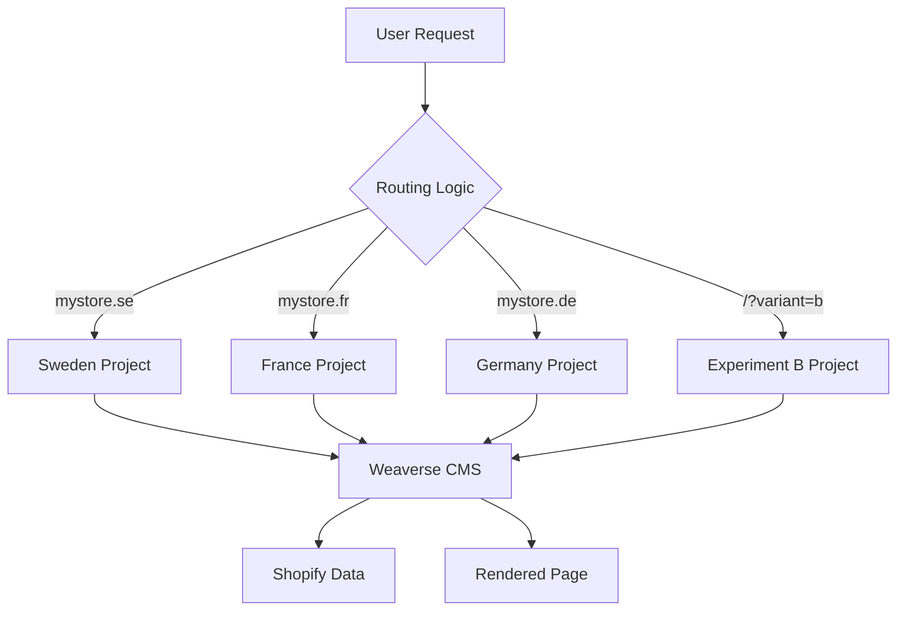

# Multi-Project Architecture

Learn how to leverage Weaverse's Multi-Project Architecture to build sophisticated storefronts supporting multiple markets, run A/B tests, and manage multiple brands from a single Shopify store.

## Overview

Multi-Project Architecture allows you to create and manage multiple independent Weaverse projects, each with its own theme settings, content, and page structures, while sharing the same Shopify data source and codebase.

### What is Multi-Project Architecture?

Instead of managing all content in a single Weaverse project, you can create separate projects for different:

- **Markets & Locales** - Sweden (mystore.se), France (mystore.fr), Germany (mystore.de)
- **A/B Test Variants** - Test different themes, layouts, or content strategies
- **Brands** - Multiple brands from one Shopify store with distinct identities
- **Environments** - Separate dev, staging, and production projects



### Key Benefits

<CardGroup cols={3}>
  <Card title="Independent Themes" icon="palette">
    Each project has completely different colors, fonts, layouts, and branding
  </Card>

  <Card title="Market-Specific Content" icon="globe">
    Unique page structures, navigation, and content tailored per market
  </Card>

  <Card title="A/B Testing" icon="flask">
    Run experiments with different designs and track performance
  </Card>

  <Card title="Brand Separation" icon="building">
    Multiple brands with distinct identities from one Shopify store
  </Card>

  <Card title="Team Isolation" icon="users">
    Different teams manage their projects independently
  </Card>

  <Card title="Flexible Routing" icon="route">
    Support any URL structure: domains, subdomains, paths, or custom logic
  </Card>
</CardGroup>

---

## When to Use Multi-Project

### Use Multi-Project Architecture When:

<Check>**Different branding per market** - Each locale needs unique colors, fonts, layouts</Check>
<Check>**Top-level domains or subdomains** - mystore.se, mystore.fr, se.mystore.com</Check>
<Check>**A/B testing is important** - Testing themes, layouts, content strategies</Check>
<Check>**Market-specific pages** - Different navigation, page types per locale</Check>
<Check>**Multiple brands** - Sub-brands with distinct identities</Check>
<Check>**Team isolation needed** - Separate teams per market without conflicts</Check>
<Check>**Staged rollouts** - Launch features to specific markets first</Check>

### Use Single-Project Architecture When:

<Check>**Content translation only** - Same branding across all locales</Check>
<Check>**Centralized management** - One team manages all markets</Check>
<Check>**Path-based URLs** - `/en-us`, `/fr-ca` URL structure</Check>
<Check>**Limited budget/team** - Smaller operation with simpler needs</Check>
<Check>**Shared theme settings** - All markets use identical styling</Check>

<Tip>
**Decision Guide:** If you answered "yes" to 3+ items in the multi-project list, consider multi-project architecture. Otherwise, start with single-project and migrate later if needed.
</Tip>

---

## Core Concepts

### The `projectId` Parameter

The `projectId` is the unique identifier for each Weaverse project. You can configure it at two levels:

#### 1. Client-Level (WeaverseClient)

Set the default project for all routes:

```typescript
// Static projectId (single project)
const weaverse = new WeaverseClient({
  // ...
  projectId: "project-default-123",
});

// Dynamic projectId (multi-project - recommended)
const weaverse = new WeaverseClient({
  // ...
  projectId: () => {
    let origin = new URL(request.url).origin;

    if (origin === "https://mystore.se") {
      return "project-sweden-456";
    } else if (origin === "https://mystore.fr") {
      return "project-france-789";
    }

    return process.env.WEAVERSE_PROJECT_ID;
  },
});
```

#### 2. Route-Level (loadPage)

Override the project for specific routes:

```typescript
// Override projectId for a specific route
export async function loader({ context, params }: LoaderFunctionArgs) {
  let { weaverse } = context;

  // Load content from a different project for this specific route
  let weaverseData = await weaverse.loadPage({
    type: "PRODUCT",
    handle: params.productHandle,
    projectId: "project-special-campaign-123", // Route-level override
  });

  return { weaverseData };
}
```

<Note>
**When to use which approach:**
- **Client-level**: Use for global routing logic (domain-based, subdomain-based, cookie-based)
- **Route-level**: Use for specific pages that need different projects (special campaigns, featured collections, testing specific routes)
</Note>

### Project Routing Flow

1. **User makes request** to your storefront (e.g., `mystore.se/products/shoe`)
2. **Route loader executes** and calls `weaverse.loadPage()`
3. **Project determination**:
   - If route specifies `projectId` parameter → use that project
   - Otherwise, WeaverseClient evaluates its `projectId` function → use returned project
4. **Weaverse loads** content from the determined project
5. **Page renders** with project's theme settings and content

<Tip>
Route-level `projectId` always takes precedence over client-level configuration, allowing fine-grained control per route.
</Tip>

### Project Lifecycle in Studio

<Steps>
  <Step title="Create Base Project">
    Develop your primary storefront in Weaverse Studio. This becomes your template for other projects.
  </Step>

  <Step title="Duplicate Project">
    In Studio, duplicate your base project for each market, variant, or brand. Each gets a unique project ID.
  </Step>

  <Step title="Customize Independently">
    Modify each project's theme settings, content, pages, and navigation without affecting other projects.
  </Step>

  <Step title="Implement Routing">
    Add `projectId` routing logic to your codebase to direct traffic to the correct project.
  </Step>
</Steps>

---

## Use Case 1: Multi-Market Localization

Build a global storefront with different domains per country, each with market-specific branding and content.

### Business Case

**Scenario:** You operate in Sweden, France, and Germany with:
- Different domains: `mystore.se`, `mystore.fr`, `mystore.de`
- Market-specific branding (colors, logos)
- Localized content and navigation
- Regional promotions and campaigns

### Studio Workflow

**1. Create Sweden Project (Base)**
- Build your primary storefront for Sweden
- Set Swedish theme settings (blue/yellow colors, Swedish fonts)
- Create content and navigation in Swedish

**2. Duplicate for France**
- In Studio: Click project menu → "Duplicate Project"
- Name: "France Market"
- Project ID: `project-france-456` (auto-generated)

**3. Customize France Project**
- Update theme settings (blue/white/red colors, French fonts)
- Translate content to French
- Adjust navigation for French market
- Add France-specific promotions

**4. Repeat for Germany**
- Duplicate base project
- Customize for German market (black/red/yellow, German content)

### Technical Implementation

#### WeaverseClient Setup

```typescript
// app/lib/weaverse/weaverse.server.ts
import { WeaverseClient } from "@weaverse/hydrogen";
import type { HydrogenContext, HydrogenThemeSchema, HydrogenComponent } from "@weaverse/hydrogen";

export function createWeaverseClient(args: {
  hydrogenContext: HydrogenContext;
  request: Request;
  cache: Cache;
  themeSchema: HydrogenThemeSchema;
  components: HydrogenComponent[];
}) {
  let { hydrogenContext, request, cache, themeSchema, components } = args;

  return new WeaverseClient({
    ...hydrogenContext,
    request,
    cache,
    themeSchema,
    components,
    projectId: () => {
      let origin = new URL(request.url).origin;

      // Map domains to project IDs
      const projectMap: Record<string, string> = {
        "https://mystore.se": process.env.WEAVERSE_PROJECT_SWEDEN!,
        "https://mystore.fr": process.env.WEAVERSE_PROJECT_FRANCE!,
        "https://mystore.de": process.env.WEAVERSE_PROJECT_GERMANY!,
      };

      return projectMap[origin] || process.env.WEAVERSE_PROJECT_ID!;
    },
  });
}
```

#### Environment Variables

```bash
# .env
WEAVERSE_PROJECT_ID=project-default-123          # Default/dev project
WEAVERSE_PROJECT_SWEDEN=project-sweden-456       # Sweden: mystore.se
WEAVERSE_PROJECT_FRANCE=project-france-789       # France: mystore.fr
WEAVERSE_PROJECT_GERMANY=project-germany-012     # Germany: mystore.de
```

#### Server Entry Point

```typescript
// app/entry.server.tsx or server.ts
import { createWeaverseClient } from "~/lib/weaverse/weaverse.server";
import { themeSchema } from "~/weaverse/schema.server";
import { components } from "~/weaverse";

export default {
  async fetch(request: Request, env: Env, context: ExecutionContext) {
    // ... Hydrogen context setup ...

    let weaverse = createWeaverseClient({
      hydrogenContext,
      request,
      cache,
      themeSchema,
      components,
    });

    // Weaverse automatically uses correct project based on domain
    return handleRequest(request, {
      ...hydrogenContext,
      weaverse,
    });
  },
};
```

#### Route Usage

```typescript
// app/routes/($locale)._index.tsx
export async function loader({ context }: LoaderFunctionArgs) {
  let { weaverse } = context;

  // No projectId needed - already determined by WeaverseClient
  let weaverseData = await weaverse.loadPage({
    type: "INDEX",
  });

  return { weaverseData };
}

// app/routes/products.$productHandle.tsx
export async function loader({ params, context }: LoaderFunctionArgs) {
  let { weaverse, storefront } = context;
  let { productHandle } = params;

  // Load product from Shopify (shared across all projects)
  let { product } = await storefront.query(PRODUCT_QUERY, {
    variables: { handle: productHandle },
  });

  // Load Weaverse page (project-specific content and layout)
  let weaverseData = await weaverse.loadPage({
    type: "PRODUCT",
    handle: productHandle,
  });

  return { weaverseData, product };
}
```

### DNS & Deployment Setup

**1. Domain Configuration (Shopify Domains)**

For each market, add custom domains in your Shopify admin:

1. Go to **Settings → Domains** in Shopify admin
2. Click **Connect existing domain** for each market domain
3. Configure DNS according to Shopify's instructions:

```
mystore.se    → CNAME → shops.myshopify.com
mystore.fr    → CNAME → shops.myshopify.com
mystore.de    → CNAME → shops.myshopify.com
```

**2. Shopify Oxygen Deployment**

Deploy your Hydrogen storefront to Shopify Oxygen:

```bash
# Deploy to Oxygen
npm run deploy

# Or using Shopify CLI
shopify hydrogen deploy
```

**3. Environment Variables (Oxygen)**

Set project IDs in your Oxygen deployment:

```bash
# Using Shopify CLI
shopify hydrogen env set WEAVERSE_PROJECT_SWEDEN project-sweden-456
shopify hydrogen env set WEAVERSE_PROJECT_FRANCE project-france-789
shopify hydrogen env set WEAVERSE_PROJECT_GERMANY project-germany-012
shopify hydrogen env set WEAVERSE_PROJECT_DEFAULT project-default-123
```

Or configure via Shopify Admin:
1. Go to **Settings → Hydrogen**
2. Select your storefront
3. Add environment variables under **Environment variables**

**4. SSL Certificates**

Shopify automatically provisions and manages SSL certificates for all connected domains.

### Testing

```bash
# Test Sweden project
curl https://mystore.se

# Test France project
curl https://mystore.fr

# Test Germany project
curl https://mystore.de

# Verify correct project loads for each domain
```

### Complete Example

```typescript
// Complete implementation for 3 markets

// app/lib/weaverse/weaverse.server.ts
export function createWeaverseClient(args: CreateWeaverseClientArgs) {
  let { hydrogenContext, request, cache, themeSchema, components } = args;

  return new WeaverseClient({
    ...hydrogenContext,
    request,
    cache,
    themeSchema,
    components,
    projectId: () => {
      let url = new URL(request.url);
      let origin = url.origin;

      // Market-specific projects
      if (origin === "https://mystore.se") {
        return process.env.WEAVERSE_PROJECT_SWEDEN!;
      }

      if (origin === "https://mystore.fr") {
        return process.env.WEAVERSE_PROJECT_FRANCE!;
      }

      if (origin === "https://mystore.de") {
        return process.env.WEAVERSE_PROJECT_GERMANY!;
      }

      // Development/staging fallback
      if (process.env.NODE_ENV !== "production") {
        return process.env.WEAVERSE_PROJECT_ID!;
      }

      // Default production project (e.g., .com)
      return process.env.WEAVERSE_PROJECT_DEFAULT!;
    },
  });
}

// app/routes/_index.tsx
export async function loader({ context }: LoaderFunctionArgs) {
  let { weaverse } = context;

  // Loads content from project determined by domain
  let weaverseData = await weaverse.loadPage({ type: "INDEX" });

  if (!weaverseData) {
    throw new Response("Not Found", { status: 404 });
  }

  return { weaverseData };
}

export default function Homepage() {
  return <WeaverseContent />;
}
```

---

## Use Case 2: A/B Testing & Experimentation

Run experiments with different themes, layouts, or content strategies to optimize conversions.

### Business Case

**Scenario:** You want to test:
- **Control (A):** Current theme with blue color scheme
- **Variant (B):** New theme with green color scheme and different layout

**Goal:** Measure which version drives more conversions (add-to-cart, purchases).

### A/B Testing Fundamentals

**Key Concepts:**
- **Control:** Original version (baseline)
- **Variant:** New version being tested
- **Traffic Split:** How you divide users (50/50, 80/20, etc.)
- **Consistency:** Same user sees same variant across sessions
- **Tracking:** Measure performance metrics for each variant

### Studio Workflow

**1. Create Control Project (A)**
- Your existing production project
- Project ID: `project-control-123`

**2. Duplicate for Variant (B)**
- Duplicate control project in Studio
- Name: "Green Theme Experiment"
- Project ID: `project-variant-456`

**3. Customize Variant**
- Change theme colors to green
- Modify homepage layout
- Update CTA buttons
- Adjust product page design

**4. Track Experiments**
- Document changes made in variant
- Note start date and goals
- Plan when to end experiment

### Technical Implementation: Cookie-Based Routing

```typescript
// app/lib/weaverse/ab-testing.server.ts
import { createCookie } from "@shopify/remix-oxygen";

// Cookie to store user's variant assignment
export let experimentCookie = createCookie("weaverse-experiment", {
  maxAge: 60 * 60 * 24 * 30, // 30 days
  httpOnly: true,
  secure: true,
  sameSite: "lax",
});

/**
 * Assign user to variant based on traffic split
 * @param split - Percentage of traffic for variant B (0-100)
 */
export function assignVariant(split: number = 50): "A" | "B" {
  let random = Math.random() * 100;
  return random < split ? "B" : "A";
}

/**
 * Get or assign user's experiment variant
 */
export async function getExperimentVariant(
  request: Request,
  split: number = 50
): Promise<"A" | "B"> {
  let cookieHeader = request.headers.get("Cookie");
  let cookie = await experimentCookie.parse(cookieHeader);

  // Return existing assignment if found
  if (cookie?.variant === "A" || cookie?.variant === "B") {
    return cookie.variant;
  }

  // Assign new variant
  return assignVariant(split);
}

/**
 * Set experiment variant cookie in response
 */
export async function setExperimentCookie(
  headers: Headers,
  variant: "A" | "B"
): Promise<Headers> {
  headers.append(
    "Set-Cookie",
    await experimentCookie.serialize({ variant })
  );
  return headers;
}
```

#### WeaverseClient with A/B Testing

```typescript
// app/lib/weaverse/weaverse.server.ts
import { getExperimentVariant, setExperimentCookie } from "./ab-testing.server";

export async function createWeaverseClient(args: CreateWeaverseClientArgs) {
  let { hydrogenContext, request, cache, themeSchema, components } = args;

  // Get user's assigned variant (50/50 split)
  let variant = await getExperimentVariant(request, 50);

  let weaverse = new WeaverseClient({
    ...hydrogenContext,
    request,
    cache,
    themeSchema,
    components,
    projectId: () => {
      // A/B test: Route to different projects based on variant
      if (variant === "B") {
        return process.env.WEAVERSE_PROJECT_VARIANT_B!;
      }
      return process.env.WEAVERSE_PROJECT_CONTROL!;
    },
  });

  return { weaverse, experimentVariant: variant };
}
```

#### Root Route with Cookie Setting

```typescript
// app/root.tsx
import { setExperimentCookie } from "~/lib/weaverse/ab-testing.server";

export async function loader({ request, context }: LoaderFunctionArgs) {
  let { weaverse, experimentVariant } = await createWeaverseClient({
    hydrogenContext: context,
    request,
    // ... other args
  });

  // Set cookie for variant assignment
  let headers = new Headers();
  await setExperimentCookie(headers, experimentVariant);

  return json(
    { experimentVariant },
    { headers }
  );
}
```

### Advanced: 80/20 Split

```typescript
// 80% control (A), 20% variant (B)
export async function createWeaverseClient(args: CreateWeaverseClientArgs) {
  let { hydrogenContext, request, cache, themeSchema, components } = args;

  // 80/20 split: 80% see control, 20% see variant
  let variant = await getExperimentVariant(request, 20);

  let weaverse = new WeaverseClient({
    ...hydrogenContext,
    request,
    cache,
    themeSchema,
    components,
    projectId: () => {
      return variant === "B"
        ? process.env.WEAVERSE_PROJECT_VARIANT_B!
        : process.env.WEAVERSE_PROJECT_CONTROL!;
    },
  });

  return { weaverse, experimentVariant: variant };
}
```

### Analytics Integration

Track experiment performance with your analytics provider:

```typescript
// app/routes/_index.tsx
export async function loader({ request, context }: LoaderFunctionArgs) {
  let { weaverse, experimentVariant } = await createWeaverseClient({
    // ... args
  });

  let weaverseData = await weaverse.loadPage({ type: "INDEX" });

  return {
    weaverseData,
    experimentVariant, // Pass to client for analytics
  };
}

export default function Homepage() {
  let { experimentVariant } = useLoaderData<typeof loader>();

  useEffect(() => {
    // Track experiment variant in analytics
    if (typeof window !== "undefined" && window.gtag) {
      window.gtag("event", "experiment_view", {
        experiment_id: "green-theme-test",
        variant_id: experimentVariant,
      });
    }
  }, [experimentVariant]);

  return <WeaverseContent />;
}
```

### Complete A/B Testing Example

```typescript
// Complete implementation with analytics

// app/lib/weaverse/ab-testing.server.ts
import { createCookie } from "@shopify/remix-oxygen";

export let experimentCookie = createCookie("weaverse-experiment", {
  maxAge: 60 * 60 * 24 * 30,
  httpOnly: true,
  secure: true,
  sameSite: "lax",
});

export function assignVariant(split: number = 50): "A" | "B" {
  return Math.random() * 100 < split ? "B" : "A";
}

export async function getExperimentVariant(
  request: Request,
  split: number = 50
): Promise<"A" | "B"> {
  let cookieHeader = request.headers.get("Cookie");
  let cookie = await experimentCookie.parse(cookieHeader);

  if (cookie?.variant === "A" || cookie?.variant === "B") {
    return cookie.variant;
  }

  return assignVariant(split);
}

// app/lib/weaverse/weaverse.server.ts
export async function createWeaverseClient(args: CreateWeaverseClientArgs) {
  let { hydrogenContext, request, cache, themeSchema, components } = args;

  let variant = await getExperimentVariant(request, 50);

  let weaverse = new WeaverseClient({
    ...hydrogenContext,
    request,
    cache,
    themeSchema,
    components,
    projectId: () => {
      if (variant === "B") {
        return process.env.WEAVERSE_PROJECT_VARIANT_B!;
      }
      return process.env.WEAVERSE_PROJECT_CONTROL!;
    },
  });

  return { weaverse, experimentVariant: variant };
}

// app/root.tsx
export async function loader({ request, context }: LoaderFunctionArgs) {
  let { weaverse, experimentVariant } = await createWeaverseClient({
    hydrogenContext: context,
    request,
    cache: context.storefront.cache,
    themeSchema,
    components,
  });

  let headers = new Headers();
  await setExperimentCookie(headers, experimentVariant);

  return json(
    {
      experimentVariant,
      experimentId: "green-theme-test",
    },
    { headers }
  );
}

export default function App() {
  let { experimentVariant, experimentId } = useLoaderData<typeof loader>();

  useEffect(() => {
    // Send to Google Analytics
    if (typeof window !== "undefined" && window.gtag) {
      window.gtag("event", "experiment_view", {
        experiment_id: experimentId,
        variant_id: experimentVariant,
      });
    }
  }, [experimentVariant, experimentId]);

  return (
    <html>
      <body>
        <Outlet />
      </body>
    </html>
  );
}
```

### Route-Level A/B Testing

For testing specific pages or routes without affecting the entire site:

```typescript
// app/routes/products.$productHandle.tsx
export async function loader({ context, params, request }: LoaderFunctionArgs) {
  let { weaverse } = context;
  let { productHandle } = params;

  // Determine variant (from cookie, header, query param, etc.)
  let variant = await getExperimentVariant(request);

  // Override project for this specific route only
  let projectId = variant === "B"
    ? process.env.WEAVERSE_PROJECT_PRODUCT_VARIANT_B!
    : process.env.WEAVERSE_PROJECT_CONTROL!;

  let weaverseData = await weaverse.loadPage({
    type: "PRODUCT",
    handle: productHandle,
    projectId, // Route-level override
  });

  return { weaverseData, variant };
}
```

**Use Cases for Route-Level A/B Testing:**
- Test product page layouts without changing homepage
- Experiment with collection page designs
- Test checkout flow variations
- Try different landing page versions for campaigns

<Warning>
Route-level testing requires careful cookie/variant management to ensure consistency. Consider using client-level projectId for site-wide experiments.
</Warning>

### A/B Testing Best Practices

<AccordionGroup>
  <Accordion title="Run Experiments Long Enough" icon="clock">
    **Minimum Duration:** 2 weeks to account for weekday/weekend variations

    **Sample Size:** Ensure enough traffic for statistical significance

    **Avoid:** Ending tests too early based on initial results
  </Accordion>

  <Accordion title="Test One Variable at a Time" icon="flask">
    **Good:** Test color scheme OR layout separately

    **Bad:** Change colors AND layout AND copy simultaneously

    **Why:** Isolate what drives performance differences
  </Accordion>

  <Accordion title="Ensure Consistent Experience" icon="user-check">
    **Critical:** Same user always sees same variant

    **Implementation:** Use cookies with long expiry (30 days)

    **Avoid:** Random assignment on every page load
  </Accordion>

  <Accordion title="Monitor Technical Metrics" icon="gauge-high">
    **Track:**
    - Page load time per variant
    - Error rates
    - Bounce rates

    **Why:** Ensure variant isn't causing technical issues
  </Accordion>
</AccordionGroup>

---

## Use Case 3: Multi-Brand Storefronts

Manage multiple brands with distinct identities from a single Shopify store.

### Business Case

**Scenario:** You operate two brands from one Shopify store:
- **Brand A** (Premium) - `brand-a.mystore.com` - Luxury positioning, dark theme
- **Brand B** (Affordable) - `brand-b.mystore.com` - Value positioning, bright theme

**Requirements:**
- Completely different branding and themes
- Separate navigation and content
- Shared product catalog (same Shopify store)
- Independent marketing campaigns

### Studio Workflow

**1. Create Brand A Project**
- Build premium brand theme (dark colors, elegant fonts)
- Curate product collections for Brand A
- Create luxury-focused content and navigation

**2. Duplicate for Brand B**
- Duplicate Brand A project
- Complete theme redesign (bright colors, friendly fonts)
- Adjust product presentation for value positioning
- Create different content and messaging

### Technical Implementation: Subdomain Routing

```typescript
// app/lib/weaverse/weaverse.server.ts
export function createWeaverseClient(args: CreateWeaverseClientArgs) {
  let { hydrogenContext, request, cache, themeSchema, components } = args;

  return new WeaverseClient({
    ...hydrogenContext,
    request,
    cache,
    themeSchema,
    components,
    projectId: () => {
      let url = new URL(request.url);
      let subdomain = url.hostname.split(".")[0];

      // Map subdomains to brand projects
      const brandProjects: Record<string, string> = {
        "brand-a": process.env.WEAVERSE_PROJECT_BRAND_A!,
        "brand-b": process.env.WEAVERSE_PROJECT_BRAND_B!,
      };

      return brandProjects[subdomain] || process.env.WEAVERSE_PROJECT_ID!;
    },
  });
}
```

#### Environment Variables

```bash
# .env
WEAVERSE_PROJECT_BRAND_A=project-brand-a-premium-123
WEAVERSE_PROJECT_BRAND_B=project-brand-b-affordable-456
WEAVERSE_PROJECT_ID=project-default-789  # Fallback
```

#### Brand-Specific Product Filtering

```typescript
// app/routes/products._index.tsx
export async function loader({ request, context }: LoaderFunctionArgs) {
  let { weaverse, storefront } = context;
  let url = new URL(request.url);
  let brand = url.hostname.split(".")[0];

  // Load Weaverse page (brand-specific layout)
  let weaverseData = await weaverse.loadPage({ type: "COLLECTION_LIST" });

  // Filter Shopify products by brand tag
  let brandTag = brand === "brand-a" ? "Premium" : "Affordable";

  let { products } = await storefront.query(PRODUCTS_QUERY, {
    variables: {
      filters: { tag: brandTag },
    },
  });

  return { weaverseData, products, brand };
}
```

### DNS Configuration (Shopify)

Configure custom domains in Shopify admin for each brand:

```
brand-a.mystore.com  → CNAME → shops.myshopify.com
brand-b.mystore.com  → CNAME → shops.myshopify.com
```

1. Go to **Settings → Domains** in Shopify admin
2. Add each subdomain as a custom domain
3. Follow Shopify's DNS configuration instructions

### Complete Multi-Brand Example

```typescript
// Complete multi-brand implementation

// app/lib/weaverse/brand-detection.server.ts
export type Brand = "brand-a" | "brand-b" | "default";

export function detectBrand(request: Request): Brand {
  let url = new URL(request.url);
  let subdomain = url.hostname.split(".")[0];

  if (subdomain === "brand-a") return "brand-a";
  if (subdomain === "brand-b") return "brand-b";
  return "default";
}

export function getBrandConfig(brand: Brand) {
  const configs = {
    "brand-a": {
      name: "Premium Brand",
      projectId: process.env.WEAVERSE_PROJECT_BRAND_A!,
      productTag: "Premium",
      theme: "luxury",
    },
    "brand-b": {
      name: "Affordable Brand",
      projectId: process.env.WEAVERSE_PROJECT_BRAND_B!,
      productTag: "Affordable",
      theme: "value",
    },
    "default": {
      name: "Default Store",
      projectId: process.env.WEAVERSE_PROJECT_ID!,
      productTag: null,
      theme: "default",
    },
  };

  return configs[brand];
}

// app/lib/weaverse/weaverse.server.ts
import { detectBrand, getBrandConfig } from "./brand-detection.server";

export function createWeaverseClient(args: CreateWeaverseClientArgs) {
  let { hydrogenContext, request, cache, themeSchema, components } = args;

  let brand = detectBrand(request);
  let brandConfig = getBrandConfig(brand);

  let weaverse = new WeaverseClient({
    ...hydrogenContext,
    request,
    cache,
    themeSchema,
    components,
    projectId: brandConfig.projectId,
  });

  return { weaverse, brand, brandConfig };
}

// app/routes/products._index.tsx
export async function loader({ request, context }: LoaderFunctionArgs) {
  let { weaverse, brand, brandConfig } = await createWeaverseClient({
    // ... args
  });

  let weaverseData = await weaverse.loadPage({ type: "COLLECTION_LIST" });

  // Filter products by brand tag
  let filters = brandConfig.productTag
    ? { tag: brandConfig.productTag }
    : {};

  let { products } = await context.storefront.query(PRODUCTS_QUERY, {
    variables: { filters },
  });

  return { weaverseData, products, brandConfig };
}
```

---

## Technical Implementation Deep Dive

### WeaverseClient Configuration

#### Static Project ID

```typescript
// Simplest form - one project for entire app
const weaverse = new WeaverseClient({
  ...hydrogenContext,
  request,
  cache,
  themeSchema,
  components,
  projectId: "project-123",
});
```

#### Function-Based Project ID

```typescript
// Dynamic project selection
const weaverse = new WeaverseClient({
  ...hydrogenContext,
  request,
  cache,
  themeSchema,
  components,
  projectId: () => {
    // Your routing logic here
    return determineProject(request);
  },
});
```

### Route-Level Project Override

Override the default project for specific routes using the `projectId` parameter in `loadPage()`:

#### Basic Route Override

```typescript
// app/routes/special-campaign.$slug.tsx
export async function loader({ params, context }: LoaderFunctionArgs) {
  let { weaverse } = context;
  let { slug } = params;

  // This route uses a special campaign project
  let weaverseData = await weaverse.loadPage({
    type: "PAGE",
    handle: slug,
    projectId: process.env.WEAVERSE_PROJECT_CAMPAIGN!, // Route-level override
  });

  return { weaverseData };
}
```

#### Conditional Route Override

```typescript
// app/routes/products.$productHandle.tsx
export async function loader({ params, context, request }: LoaderFunctionArgs) {
  let { weaverse } = context;
  let { productHandle } = params;

  // Use special project for featured products
  let isFeaturedProduct = productHandle.startsWith("featured-");

  let projectId = isFeaturedProduct
    ? process.env.WEAVERSE_PROJECT_FEATURED!
    : undefined; // Use default from WeaverseClient

  let weaverseData = await weaverse.loadPage({
    type: "PRODUCT",
    handle: productHandle,
    projectId, // Conditional override
  });

  return { weaverseData };
}
```

#### Dynamic Route Override Based on Parameters

```typescript
// app/routes/collections.$collectionHandle.tsx
export async function loader({ params, context, request }: LoaderFunctionArgs) {
  let { weaverse } = context;
  let { collectionHandle } = params;

  // Map specific collections to different projects
  const collectionProjectMap: Record<string, string> = {
    "vip-collection": process.env.WEAVERSE_PROJECT_VIP!,
    "black-friday": process.env.WEAVERSE_PROJECT_SALE!,
    "new-arrivals": process.env.WEAVERSE_PROJECT_NEW!,
  };

  let projectId = collectionProjectMap[collectionHandle];

  let weaverseData = await weaverse.loadPage({
    type: "COLLECTION",
    handle: collectionHandle,
    projectId, // Use mapped project or default
  });

  return { weaverseData };
}
```

**Use Cases for Route-Level Override:**

<CardGroup cols={2}>
  <Card title="Campaign Landing Pages" icon="bullhorn">
    Use dedicated projects for seasonal campaigns, sales events, or promotional pages
  </Card>

  <Card title="Featured Collections" icon="star">
    Highlight special collections with unique designs and layouts
  </Card>

  <Card title="Beta Features" icon="flask">
    Test new features on specific routes before rolling out site-wide
  </Card>

  <Card title="VIP/Premium Content" icon="crown">
    Special experiences for premium products or VIP customer segments
  </Card>
</CardGroup>

<Tip>
**When to use route-level vs client-level:**
- **Client-level**: Global routing (domains, locales, A/B tests affecting entire site)
- **Route-level**: Specific pages that need different content (campaigns, special collections, temporary experiments)
</Tip>

### Advanced Routing Patterns

#### Path-Based Routing

```typescript
// Route to different projects based on URL path
projectId: () => {
  let url = new URL(request.url);
  let path = url.pathname;

  // /pro routes use premium project
  if (path.startsWith("/pro")) {
    return process.env.WEAVERSE_PROJECT_PRO!;
  }

  // /basic routes use basic project
  if (path.startsWith("/basic")) {
    return process.env.WEAVERSE_PROJECT_BASIC!;
  }

  return process.env.WEAVERSE_PROJECT_ID!;
}
```

#### Query Parameter Routing

```typescript
// Route based on query parameters
projectId: () => {
  let url = new URL(request.url);
  let variant = url.searchParams.get("variant");

  if (variant === "b") {
    return process.env.WEAVERSE_PROJECT_VARIANT_B!;
  }

  return process.env.WEAVERSE_PROJECT_CONTROL!;
}
```

#### Header-Based Routing

```typescript
// Route based on custom headers (for programmatic control)
projectId: () => {
  let projectHeader = request.headers.get("X-Weaverse-Project");

  if (projectHeader && isValidProjectId(projectHeader)) {
    return projectHeader;
  }

  return process.env.WEAVERSE_PROJECT_ID!;
}
```

#### Combined Routing Strategy

```typescript
// Combine multiple routing strategies
projectId: () => {
  let url = new URL(request.url);
  let origin = url.origin;
  let path = url.pathname;
  let subdomain = url.hostname.split(".")[0];

  // Priority 1: Domain-based (highest priority)
  if (origin === "https://mystore.se") {
    return process.env.WEAVERSE_PROJECT_SWEDEN!;
  }

  // Priority 2: Subdomain-based
  if (subdomain === "premium") {
    return process.env.WEAVERSE_PROJECT_PREMIUM!;
  }

  // Priority 3: Path-based
  if (path.startsWith("/campaign")) {
    return process.env.WEAVERSE_PROJECT_CAMPAIGN!;
  }

  // Default
  return process.env.WEAVERSE_PROJECT_ID!;
}
```

### Performance Considerations

#### Caching Strategies

```typescript
// Per-project caching
export async function loader({ params, context }: LoaderFunctionArgs) {
  let { weaverse } = context;

  let weaverseData = await weaverse.loadPage({
    type: "PRODUCT",
    handle: params.productHandle,
    strategy: {
      maxAge: 3600, // Cache for 1 hour
      swr: 86400,   // Stale-while-revalidate for 24 hours
    },
  });

  return { weaverseData };
}
```

#### CDN Configuration

Ensure your CDN caches correctly per project:

```typescript
// Add project ID to cache key
export async function loader({ request, context }: LoaderFunctionArgs) {
  let { weaverse } = context;

  // Determine project ID
  let projectId = typeof weaverse.projectId === "function"
    ? weaverse.projectId()
    : weaverse.projectId;

  // Add to response headers for CDN
  let headers = new Headers();
  headers.set("X-Project-ID", projectId);
  headers.set("Vary", "Host"); // Vary cache by hostname

  let weaverseData = await weaverse.loadPage({ type: "INDEX" });

  return json({ weaverseData }, { headers });
}
```

---

## Migration Guide

Step-by-step guide to migrate from single-project to multi-project architecture.

### Phase 1: Planning (1-2 days)

<Steps>
  <Step title="Assess Current Setup">
    **Audit your current implementation:**
    - Current project ID and environment variables
    - Number of markets/brands you need
    - URL structure requirements (domains, subdomains, paths)
    - Team structure and responsibilities

    **Document:**
    - List of projects needed
    - Project IDs (will get from Studio)
    - Routing logic requirements
  </Step>

  <Step title="Define Project Structure">
    **Decide on:**
    - How many projects you need
    - Naming convention for projects
    - Which project will be your "base" template
    - URL routing strategy

    **Example Structure:**
    ```
    Project 1: Sweden Market (mystore.se)
    Project 2: France Market (mystore.fr)
    Project 3: Germany Market (mystore.de)
    Project 4: Default/Development
    ```
  </Step>

  <Step title="Plan Routing Strategy">
    **Choose routing method:**
    - Domain-based (recommended for markets)
    - Subdomain-based (good for brands)
    - Path-based (simpler but less isolated)
    - Hybrid approach

    **Document routing logic** you'll implement
  </Step>
</Steps>

### Phase 2: Studio Setup (2-4 hours)

<Steps>
  <Step title="Identify Base Project">
    Your existing project becomes the template.

    **Note down:**
    - Current project ID (find in Studio settings)
    - Theme settings to replicate
    - Key pages and sections
  </Step>

  <Step title="Duplicate Projects">
    **For each market/brand:**
    1. Open your project in Weaverse Studio
    2. Click project menu → "Duplicate Project"
    3. Name: "Sweden Market" (or similar)
    4. **Copy project ID** from Studio (e.g., `project-sweden-456`)
    5. Repeat for all projects needed

    **Result:** You now have multiple projects, each with unique ID
  </Step>

  <Step title="Initial Customization">
    **For each new project:**
    - Update theme settings (colors, fonts if needed)
    - Test that project loads in Studio
    - Don't do full customization yet (do after code is deployed)
  </Step>
</Steps>

### Phase 3: Code Implementation (4-8 hours)

<Steps>
  <Step title="Update Environment Variables">
    **Add new project IDs to `.env`:**

    ```bash
    # .env
    WEAVERSE_PROJECT_ID=project-default-123          # Existing
    WEAVERSE_PROJECT_SWEDEN=project-sweden-456       # New
    WEAVERSE_PROJECT_FRANCE=project-france-789       # New
    WEAVERSE_PROJECT_GERMANY=project-germany-012     # New
    ```

    **Update deployment environment:**
    - Add secrets to Fly.io, Vercel, or your hosting provider
    - Test that all variables are accessible
  </Step>

  <Step title="Create WeaverseClient Factory">
    **Create or update** `app/lib/weaverse/weaverse.server.ts`:

    ```typescript
    import { WeaverseClient } from "@weaverse/hydrogen";

    export function createWeaverseClient(args: CreateWeaverseClientArgs) {
      let { hydrogenContext, request, cache, themeSchema, components } = args;

      return new WeaverseClient({
        ...hydrogenContext,
        request,
        cache,
        themeSchema,
        components,
        projectId: () => {
          let origin = new URL(request.url).origin;

          // Add your routing logic
          const projectMap: Record<string, string> = {
            "https://mystore.se": process.env.WEAVERSE_PROJECT_SWEDEN!,
            "https://mystore.fr": process.env.WEAVERSE_PROJECT_FRANCE!,
            "https://mystore.de": process.env.WEAVERSE_PROJECT_GERMANY!,
          };

          return projectMap[origin] || process.env.WEAVERSE_PROJECT_ID!;
        },
      });
    }
    ```
  </Step>

  <Step title="Update Server Entry Point">
    **Modify** `app/entry.server.tsx` or `server.ts`:

    ```typescript
    import { createWeaverseClient } from "~/lib/weaverse/weaverse.server";

    export default {
      async fetch(request: Request, env: Env, context: ExecutionContext) {
        // ... existing Hydrogen setup ...

        // Replace static WeaverseClient initialization with factory
        let weaverse = createWeaverseClient({
          hydrogenContext,
          request,
          cache,
          themeSchema,
          components,
        });

        return handleRequest(request, {
          ...hydrogenContext,
          weaverse,
        });
      },
    };
    ```
  </Step>

  <Step title="Test in Development">
    **Test routing logic:**

    ```bash
    # Start dev server
    npm run dev

    # Test default project
    curl http://localhost:3000

    # Test with host header (simulates domain routing)
    curl http://localhost:3000 -H "Host: mystore.se"
    ```

    **Verify:**
    - Correct project loads for each domain
    - No errors in console
    - Pages render correctly
  </Step>
</Steps>

### Phase 4: Content Customization (Variable time)

<Steps>
  <Step title="Customize Each Project">
    **For each market/brand project:**

    1. **Theme Settings**
       - Update colors, fonts, layouts per market
       - Adjust logo and branding elements
       - Configure market-specific settings

    2. **Content Translation**
       - Translate all text content
       - Localize navigation menus
       - Adjust imagery for market

    3. **Page Customization**
       - Modify page layouts if needed
       - Add market-specific sections
       - Configure regional promotions
  </Step>

  <Step title="Content Sync Strategy">
    **For shared content:**
    - Use Weaverse Import/Export to sync base content
    - Update components in base project, export, import to others
    - Establish workflow for keeping projects aligned

    **For unique content:**
    - Create market-specific pages directly in each project
    - Document what's shared vs unique
  </Step>
</Steps>

### Phase 5: Deployment (2-4 hours)

<Steps>
  <Step title="Configure DNS">
    **For each domain:**

    ```
    mystore.se  → A/CNAME → your-hydrogen-app.fly.dev
    mystore.fr  → A/CNAME → your-hydrogen-app.fly.dev
    mystore.de  → A/CNAME → your-hydrogen-app.fly.dev
    ```

    **SSL Certificates:**
    - Ensure SSL for all domains in hosting provider
    - Test HTTPS access for each domain
  </Step>

  <Step title="Deploy to Staging">
    **Deploy code with multi-project logic:**

    ```bash
    # Example: Fly.io deployment
    fly deploy --app your-app-staging

    # Set environment variables
    fly secrets set WEAVERSE_PROJECT_SWEDEN=project-sweden-456
    fly secrets set WEAVERSE_PROJECT_FRANCE=project-france-789
    ```

    **Test staging:**
    - Access each domain in staging
    - Verify correct project loads
    - Check all pages work correctly
  </Step>

  <Step title="Gradual Production Rollout">
    **Option A: All at once**
    - Deploy to production
    - Update DNS for all domains
    - Monitor for issues

    **Option B: Gradual (recommended)**
    1. Deploy code to production (with fallback to default project)
    2. Update DNS for one domain (e.g., mystore.se)
    3. Monitor for 24-48 hours
    4. Update DNS for remaining domains
    5. Full cutover complete
  </Step>
</Steps>

### Phase 6: Verification & Monitoring (Ongoing)

<Steps>
  <Step title="Test Each Market">
    **For each domain:**
    - ✅ Homepage loads with correct project
    - ✅ Product pages show correct theme
    - ✅ Navigation works properly
    - ✅ Search functions correctly
    - ✅ Cart and checkout work
    - ✅ All images load
    - ✅ Forms submit successfully
  </Step>

  <Step title="Monitor Performance">
    **Track metrics:**
    - Page load times per project
    - Error rates by project
    - Cache hit rates
    - User experience metrics

    **Tools:**
    - Google Analytics (segment by domain/project)
    - Performance monitoring (New Relic, Datadog)
    - Error tracking (Sentry)
  </Step>

  <Step title="Document for Team">
    **Create documentation:**
    - Which project serves which domain
    - How to customize each project in Studio
    - Routing logic explanation
    - Troubleshooting guide
    - Contact for questions
  </Step>
</Steps>

### Migration Checklist

Use this checklist to track your migration progress:

- [ ] Planning Phase
  - [ ] Current setup audited
  - [ ] Projects defined and documented
  - [ ] Routing strategy chosen
  - [ ] Team briefed on migration plan

- [ ] Studio Setup
  - [ ] Base project identified
  - [ ] Projects duplicated in Studio
  - [ ] Project IDs documented
  - [ ] Initial customization done

- [ ] Code Implementation
  - [ ] Environment variables updated
  - [ ] WeaverseClient factory created
  - [ ] Server entry point updated
  - [ ] Development testing complete

- [ ] Content Customization
  - [ ] Theme settings updated per project
  - [ ] Content translated/customized
  - [ ] Market-specific pages created
  - [ ] Content sync workflow established

- [ ] Deployment
  - [ ] DNS configured
  - [ ] SSL certificates valid
  - [ ] Staging deployment successful
  - [ ] Production deployment complete

- [ ] Verification
  - [ ] All domains tested
  - [ ] Performance monitored
  - [ ] Team documentation created
  - [ ] Success metrics tracked

---

## Best Practices & Patterns

### Project Organization

**Naming Conventions:**
```
Good:
- project-sweden-production
- project-france-production
- project-variant-b-homepage-test

Bad:
- project-123
- test-project
- my-project
```

**Environment Strategy:**
```
Development:  project-dev-default
Staging:      project-staging-default
Production:   project-prod-sweden, project-prod-france, etc.
```

### Content Synchronization

**When to sync:**
- Base component updates
- Global section changes
- Navigation structure updates
- Theme variable additions

**When to keep separate:**
- Market-specific content
- Localized text
- Regional promotions
- Market-unique pages

**Sync Workflow:**
1. Make changes in base project
2. Export affected sections/pages
3. Import into other projects
4. Customize as needed per market

### Team Collaboration

**Access Control:**
- Assign team members to specific projects
- Sweden team → Sweden project access
- France team → France project access

**Communication:**
- Document which team owns which project
- Establish process for cross-project changes
- Regular sync meetings for global updates

**Version Control:**
- Track code changes with git
- Document Studio changes in changelog
- Coordinate code deploys with content updates

### Cost Optimization

**Cache Aggressively:**
```typescript
// Long cache times for stable content
let weaverseData = await weaverse.loadPage({
  type: "INDEX",
  strategy: {
    maxAge: 3600,      // 1 hour
    swr: 86400,        // 24 hours stale-while-revalidate
  },
});
```

**CDN Configuration:**
- Cache per-project content at edge
- Vary cache by hostname
- Use stale-while-revalidate

**Build Optimization:**
- Share build artifacts between projects when possible
- Optimize images per project
- Monitor bundle sizes

---

## Troubleshooting

### Wrong Project Loading

**Symptom:** Domain shows incorrect project content

**Debug:**
```typescript
// Add logging to projectId function
projectId: () => {
  let url = new URL(request.url);
  let origin = url.origin;

  console.log("Request origin:", origin);
  console.log("Selected project:", projectMap[origin] || "default");

  return projectMap[origin] || process.env.WEAVERSE_PROJECT_ID!;
}
```

**Common Causes:**
- Environment variable not set
- Typo in domain mapping
- DNS not pointing to correct server
- Cache serving old content

**Solutions:**
- Verify environment variables with `console.log`
- Check domain in `projectMap` matches exactly
- Clear CDN cache
- Test with cache-busting query param: `?t=123`

### Content Not Syncing

**Symptom:** Updates in one project don't appear in others

**Expected Behavior:** Projects are independent by design. Content doesn't auto-sync.

**Solutions:**
- Use Import/Export in Studio to sync manually
- Update content in each project separately
- Consider if single-project with localization would be better

### Performance Issues

**Symptom:** Slow page loads, high response times

**Debug:**
```typescript
// Add timing logs
let start = Date.now();
let weaverseData = await weaverse.loadPage({ type: "INDEX" });
let duration = Date.now() - start;
console.log("Weaverse loadPage duration:", duration, "ms");
```

**Common Causes:**
- No caching configured
- Too many API calls
- Large page data
- Network latency

**Solutions:**
- Implement caching strategy
- Use CDN for static assets
- Optimize images
- Consider edge caching

### A/B Test Cookie Issues

**Symptom:** Users see different variants on each page load

**Debug:**
```typescript
// Check cookie is being set
console.log("Cookie header:", request.headers.get("Cookie"));
console.log("Assigned variant:", variant);
```

**Common Causes:**
- Cookie not being set in response
- Cookie domain mismatch
- httpOnly/secure flags incorrect
- SameSite policy blocking cookie

**Solutions:**
- Verify `Set-Cookie` header in response
- Check cookie domain matches request domain
- Adjust httpOnly/secure/sameSite settings
- Test in incognito to verify behavior

### Route-Level Override Not Working

**Symptom:** Passing `projectId` to `loadPage()` doesn't override the default project

**Debug:**
```typescript
// Verify projectId is being passed
export async function loader({ context, params }: LoaderFunctionArgs) {
  let { weaverse } = context;
  let projectId = process.env.WEAVERSE_PROJECT_CAMPAIGN!;

  console.log("Route-level projectId:", projectId);

  let weaverseData = await weaverse.loadPage({
    type: "PAGE",
    handle: params.slug,
    projectId, // Make sure this is defined
  });

  return { weaverseData };
}
```

**Common Causes:**
- `projectId` variable is `undefined`
- Environment variable not set
- Typo in parameter name
- Using wrong parameter syntax

**Solutions:**
- Verify environment variable exists: `console.log(process.env.WEAVERSE_PROJECT_CAMPAIGN)`
- Ensure projectId is not undefined before passing
- Check spelling: it's `projectId` not `project_id` or `projectID`
- Use optional chaining: `projectId: myProjectId || undefined`

---

## Advanced Topics

### Dynamic Project Selection

**Based on User Attributes:**
```typescript
// Route based on user tier (from database or session)
projectId: async () => {
  let user = await getUser(request);

  if (user.tier === "premium") {
    return process.env.WEAVERSE_PROJECT_PREMIUM!;
  }

  return process.env.WEAVERSE_PROJECT_STANDARD!;
}
```

**Based on Geographic Location:**
```typescript
// Use edge computing for geo-based routing
projectId: () => {
  // Cloudflare example
  let country = request.headers.get("CF-IPCountry");

  const countryProjects: Record<string, string> = {
    "SE": process.env.WEAVERSE_PROJECT_SWEDEN!,
    "FR": process.env.WEAVERSE_PROJECT_FRANCE!,
    "DE": process.env.WEAVERSE_PROJECT_GERMANY!,
  };

  return countryProjects[country] || process.env.WEAVERSE_PROJECT_ID!;
}
```

### Hybrid Approaches

**Combine Single and Multi-Project:**
```typescript
// Most markets use single-project with localization
// Special markets get dedicated projects
projectId: () => {
  let origin = new URL(request.url).origin;

  // Japan gets dedicated project (unique branding)
  if (origin === "https://mystore.jp") {
    return process.env.WEAVERSE_PROJECT_JAPAN!;
  }

  // All other markets use single project with locale
  return process.env.WEAVERSE_PROJECT_DEFAULT!;
}
```

### Feature Flags

**Gradual Feature Rollouts:**
```typescript
// Enable new features for specific projects first
projectId: () => {
  let url = new URL(request.url);
  let featureFlag = url.searchParams.get("feature");

  // Beta project for testing new features
  if (featureFlag === "beta") {
    return process.env.WEAVERSE_PROJECT_BETA!;
  }

  // Production project (stable)
  return process.env.WEAVERSE_PROJECT_PROD!;
}
```

---

## API Reference

### `projectId` Parameter

The `projectId` parameter can be configured at two levels with different types and behaviors:

#### Client-Level Configuration

**Location:** `WeaverseClient` constructor
**Type:** `string | (() => string)`
**Description:** Sets the default project for all routes. Function is evaluated once per request.

```typescript
// Static (single project)
const weaverse = new WeaverseClient({
  projectId: "project-123",
});

// Dynamic (multi-project)
const weaverse = new WeaverseClient({
  projectId: () => {
    // Evaluated once per request
    return determineProject(request);
  },
});
```

#### Route-Level Override

**Location:** `weaverse.loadPage()` method
**Type:** `string | undefined`
**Description:** Overrides the client-level project for a specific page load. Takes precedence over client configuration.

```typescript
// Use default from WeaverseClient
let weaverseData = await weaverse.loadPage({
  type: "PRODUCT",
  handle: "shoe",
  // projectId not specified - uses client-level default
});

// Override for this specific route
let weaverseData = await weaverse.loadPage({
  type: "PRODUCT",
  handle: "shoe",
  projectId: "project-campaign-456", // Overrides client-level
});
```

**Priority:** Route-level `projectId` > Client-level `projectId` > `WEAVERSE_PROJECT_ID` env var

### Environment Variables

**Required:**
- `WEAVERSE_PROJECT_ID` - Default/fallback project ID

**Multi-Project (add as needed):**
- `WEAVERSE_PROJECT_SWEDEN` - Sweden market project
- `WEAVERSE_PROJECT_FRANCE` - France market project
- `WEAVERSE_PROJECT_VARIANT_B` - A/B test variant
- `WEAVERSE_PROJECT_BRAND_A` - Brand A project
- etc.

**Best Practice:** Use descriptive names that indicate purpose.

---

## Summary

Multi-Project Architecture is a powerful feature for:
- ✅ **Multi-market storefronts** with different domains and branding
- ✅ **A/B testing** to optimize conversions
- ✅ **Multi-brand experiences** from one Shopify store

**Key Takeaways:**
1. Configure `projectId` at **two levels**: client-level for global routing, route-level for specific pages
2. Client-level: Use `projectId` function in WeaverseClient for domain/subdomain/cookie-based routing
3. Route-level: Pass `projectId` to `loadPage()` for campaign pages, featured collections, or experiments
4. Duplicate projects in Studio for each market/variant/brand
5. Test thoroughly before production deployment
6. Monitor performance and user experience per project

**Next Steps:**
- [Localization Guide](/guides/localization-advanced) - Combine with locale features
- [Custom Routing](/migration-advanced/custom-routing) - Advanced URL patterns
- [API Reference](/api-reference/weaverse-client) - Complete API documentation

---

<Tip>
**Need Help?** Join our [Slack community](/community/community) to ask questions and share your multi-project setup with other developers!
</Tip>
