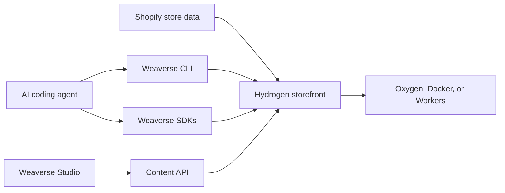

# Build Shopify Hydrogen Storefronts Visually

Weaverse brings a visual editing layer to Shopify Hydrogen, so teams can launch headless storefronts with React Router, reusable components, live previews, and merchant-friendly content editing.

<Frame>
  
</Frame>

<CardGroup cols={2}>
  <Card title="Get Started" icon="rocket" href="/intro/quickstart">
    Create your first Weaverse storefront in 5 minutes
  </Card>
  <Card title="Open Studio" icon="paintbrush" href="https://studio.weaverse.io/dashboard">
    Launch the visual editor and start building
  </Card>
</CardGroup>

---

## Choose Your Path

<CardGroup cols={3}>
  <Card title="I'm New to Weaverse" icon="seedling" href="/intro/quickstart">
    Start here if you've never used Weaverse before. Get up and running in 5 minutes.
  </Card>
  <Card title="I'm a Developer" icon="code" href="/development-guide/creating-components">
    Jump into component development, API reference, and advanced customization.
  </Card>
  <Card title="I'm a Merchant" icon="store" href="/studio-guide/interface-tour">
    Learn to use Weaverse Studio visually without writing code.
  </Card>
</CardGroup>

---

## Ecosystem at a Glance

Everything you need to build, customize, and deploy Hydrogen storefronts.

<CardGroup cols={3}>
  <Card title="Hydrogen SDKs" icon="cube" href="/developer-tools/weaverse-sdks">
    Core, React, and Hydrogen packages for building custom components.
  </Card>
  <Card title="CLI Tools" icon="terminal" href="/developer-tools/weaverse-cli">
    Scaffold projects, run dev servers, and manage deployments.
  </Card>
  <Card title="MCP Server" icon="robot" href="/developer-tools/weaverse-mcp">
    AI agent integration for Claude, Cursor, and other tools.
  </Card>
  <Card title="Content API" icon="database" href="/content-api/overview">
    Headless content delivery for pages, themes, and languages.
  </Card>
  <Card title="Visual Studio" icon="paintbrush" href="/studio-guide/interface-tour">
    Drag and drop editor with real-time preview.
  </Card>
  <Card title="Hydrogen Themes" icon="palette" href="/hydrogen-themes/pilot-theme-overview">
    Production-ready Pilot theme with full customization.
  </Card>
</CardGroup>



<CardGroup cols={3}>
  <Card title="Develop" icon="code" href="/development-guide/creating-components">
    Build Hydrogen components and expose editable settings through Weaverse schemas.
  </Card>
  <Card title="Edit" icon="paintbrush" href="/studio-guide/interface-tour">
    Let merchants arrange sections, update copy, and preview pages in Studio.
  </Card>
  <Card title="Ship" icon="cloud" href="/guides/deployment">
    Deploy the storefront to Shopify Oxygen, Docker, or Cloudflare Workers.
  </Card>
</CardGroup>

---

## Quick Start

<Steps>
  <Step title="Install">
    Scaffold a new Weaverse Hydrogen project:
    ```bash
    npx @weaverse/cli@latest create --template=pilot --project-id=YOUR_PROJECT_ID
    ```
  </Step>
  <Step title="Connect">
    Add your Weaverse project ID and start the dev server:
    ```bash
    npm run dev
    ```
    Your storefront runs at `http://localhost:3456` with live connection to Weaverse Studio.
  </Step>
  <Step title="Customize">
    Open [Weaverse Studio](https://studio.weaverse.io/dashboard), drag components onto pages, configure settings, and publish your changes — all with real-time preview.
  </Step>
</Steps>

<CardGroup cols={3}>
  <Card title="1. Create the project" icon="terminal" href="/intro/quickstart#step-4-set-up-with-your-ai-agent-recommended">
    Use the AI-agent prompt from onboarding or run the Weaverse CLI command.
  </Card>
  <Card title="2. Preview locally" icon="monitor" href="/intro/quickstart#step-5-create-project--load-studio">
    Start the Hydrogen dev server and load the storefront at `localhost:3456`.
  </Card>
  <Card title="3. Connect real data" icon="database" href="/intro/quickstart#step-7-connect-your-real-store-data">
    Swap demo content for your Shopify store data when you are ready.
  </Card>
</CardGroup>

<Frame>
  
</Frame>

---

## Popular Guides

<CardGroup cols={2}>
  <Card title="Creating Components" icon="cube" href="/development-guide/creating-components">
    Build custom React components for your storefront
  </Card>
  <Card title="Component Schema" icon="file-code" href="/development-guide/component-schema">
    Define component structure, settings, and behavior
  </Card>
  <Card title="Input Settings" icon="sliders" href="/development-guide/input-settings">
    Configure component settings with the input system
  </Card>
  <Card title="Data Fetching" icon="download" href="/development-guide/data-fetching">
    Load Shopify data with loaders and the Storefront API
  </Card>
  <Card title="Global Sections" icon="table-columns" href="/features/global-sections">
    Reusable sections shared across all pages
  </Card>
  <Card title="Deployment" icon="cloud" href="/guides/deployment">
    Deploy to Oxygen, Docker, or Cloudflare Workers
  </Card>
</CardGroup>

---

## Developer Resources

<CardGroup cols={2}>
  <Card title="API Reference" icon="book" href="/api-reference/introduction">
    Complete documentation for hooks, components, utilities, and types
  </Card>
  <Card title="Content API" icon="database" href="/content-api/overview">
    REST endpoints for pages, projects, themes, and languages
  </Card>
  <Card title="Troubleshooting" icon="wrench" href="/troubleshooting/preview-errors">
    Solutions for common issues and error messages
  </Card>
  <Card title="Community" icon="users" href="/community/community">
    Join the Slack community, contribute on GitHub, stay updated
  </Card>
</CardGroup>
